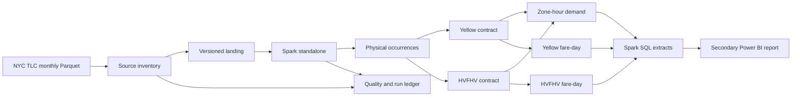

# Architecture

## System boundary

Fareline turns versioned monthly Parquet files into auditable analytical
products. It does not own the source, assign business identity to a trip, or
provide a real-time service.

## Technical identity

The idempotent unit is a source-file version identified by logical URL and
content hash. Each raw row is an occurrence identified by that file version and
its physical ordinal. Equal field values do not imply equal trips, so Fareline
preserves multiplicity and never deduplicates by a heuristic content hash.

## Execution modes

- CI uses small fixtures and Spark local mode where appropriate.
- M0 establishes a Docker Compose Spark standalone master and worker baseline;
  M1 uses it for the bounded vertical slice.
- M3 compares DuckDB, one Spark worker, and multiple Spark workers on the same
  physical host. It records shuffle, spill, skew, memory, time, and file layout.
- Worker-loss testing is valid only against standalone executor processes, not
  `local[*]`.

The container baseline uses Apache Spark 4.1.0, Scala 2.13, Python 3, and Java
17. Delta Lake 4.2.0 is compatible with Spark 4.1.x according to the upstream
[compatibility matrix](https://docs.delta.io/releases/). Delta dependencies and
write semantics enter at M1.

## Delta boundary

M2 will validate atomic publication, schema enforcement/evolution, and
incremental-versus-rebuild equivalence. Local-filesystem concurrency testing is
limited to a single Spark driver. Fareline will not generalize that result to
multi-process writers or object storage; stronger claims require M4 on the
chosen storage implementation.

## Cloud gate

M0–M3 contain no cloud provider. M4 first compares current role demand,
compatibility, regional availability, identity/IAM, IaC, and estimated cost.
Only an explicitly approved design may be applied. If M4 is skipped, Fareline
remains a local distributed lakehouse and makes no operational cloud claim.
