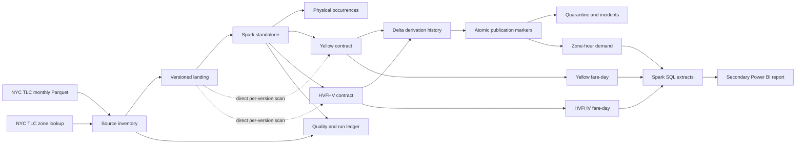

# Architecture

## System boundary

Fareline turns versioned monthly Parquet files into auditable analytical
products. It does not own the source, assign business identity to a trip, or
provide a real-time service.

## Technical identity

The idempotent unit is a source-file version identified by logical URL and
content hash. Each raw row is an occurrence identified by that file version and
its physical ordinal. Equal field values do not imply equal trips, so Fareline
preserves multiplicity and never deduplicates by a heuristic content hash.

M1 derives the ordinal from `_metadata.row_index`, the Parquet reader's physical
row position inside the file. It is produced by the scan before any shuffle, so
it does not depend on how Spark orders or packs file splits, and a landed
version is exactly one file so the in-file index is the version's ordinal.
Ingestion fails unless those ordinals form a dense `0..n-1` sequence.

## Where the contracted tables read from

The logical flow still passes through the source-occurrence grain, but the M2
job scans each landed artifact directly rather than reading the merged M1 Delta
table. A source-occurrence table preserves
source columns verbatim, so it can only hold versions whose physical schemas are
mutually compatible; the contracted table is the layer that unifies drift, and
resolving a contract against the file's own schema is what makes that possible.
Lineage is unaffected, because the technical key is the file version plus the
reader's physical row index, which the scan produces either way.

The trade-off is that the two layers are built by separate passes over the same
landed file rather than chained. The alternative, merging schemas inside the
occurrence table, would make a verbatim store depend on a union schema and would
silently reconcile the very conflicts M2 exists to report.

Source schemas are read with `spark.sql.caseSensitive` enabled, so a source
column's name is its physical identity and the contract owns case folding. Under
Spark's default resolution a file carrying both `airport_fee` and `Airport_fee`
cannot be described at all, and the collision would surface as a reader error
rather than a contract decision naming both columns.

Derived rows include a deterministic `derivation_id` over the source version,
contract fingerprint and zone-lookup version. A run identifier or an ingestion
timestamp would make two correct runs produce different rows and would destroy
the incremental-versus-rebuild comparison, so run metadata lives in the ledger
and the evidence file instead.

## Execution modes

- Unit tests run on plain Python and DuckDB, with no Spark dependency.
- The Delta integration smoke runs inside the container on fixtures it generates
  itself, so CI exercises the standalone cluster without touching the source.
- M0 establishes a Docker Compose Spark standalone master and worker baseline;
  M0.1 proves that it can write and read shared output before M1 uses it.
- The concurrency probe runs two drivers in different containers against a
  throwaway table. It is destructive by design and is not part of CI, because a
  file barrier between two Spark applications is not a dependable CI signal.
- M3 compares DuckDB, one Spark worker, and multiple Spark workers on the same
  physical host. It records shuffle, spill, skew, memory, time, and file layout.
- Worker-loss testing is valid only against standalone executor processes, not
  `local[*]`.

The container baseline uses Apache Spark 4.1.0, Scala 2.13, Python 3, and Java
17. Delta Lake 4.2.0 is compatible with Spark 4.1.x according to the upstream
[compatibility matrix](https://docs.delta.io/releases/). Delta dependencies and
write semantics enter at M1.

## Shared-storage boundary

The master/driver and every worker mount the same Docker named volumes at
`/opt/fareline/data`, `/opt/fareline/output`, `/opt/fareline/warehouse`, and
`/opt/fareline/spark-events`. A container-local `file://` path is safe only when
it resolves inside one of those shared mounts. `_SUCCESS` alone is never evidence
of publication: the cluster smoke requires visible data files and an exact
write/read count from two executor hosts.

Named volumes make the local filesystem topology explicit and reproducible in
CI. They are not evidence for object-store semantics. M1 records the volume and
path used by each run; M4 must revalidate publication behavior on any selected
cloud storage implementation.

## Delta boundary

M1 publishes one minimal Delta source-occurrence table per service on the bounded vertical
slice. Delta artifacts are supplied as user jars through a coordinate pinned in
the image rather than copied into `/opt/spark/jars`, because their transitive
closure contains older Jackson and Parquet builds that must not take precedence
over the ones Spark ships.

M1 idempotency is a published-version check followed by an append, which is safe
for the single writer M1 declares. The table also rejects a version whose
artifact completeness differs from the scope already present, preventing sample
or fixture rows from contaminating a future complete-object table.

M2 moves write idempotency into the transaction log. Every derived write carries
a Delta `txnAppId`/`txnVersion` marker derived from the table and the derivation,
so retrying the same work cannot append it twice. The three Delta tables are not
a multi-table transaction. They therefore retain physical derivation history,
and an immutable completion marker is created only after every required table
write succeeds. Marker-aware readers keep seeing the preceding active
derivation during a failed replacement; a retry completes the missing writes and
then exposes the new derivation. A scoped run never retracts omitted periods.

The integration smoke plants a failure after the first Delta table, proves that
no marker exposes the incomplete derivation, and then proves a retry publishes
the complete result. This marker protocol is measured on the shared local
filesystem used by Docker named volumes. Object storage would need its own
publication protocol and validation in M4.

The Delta append primitive was measured, with two drivers in separate containers
writing one throwaway table on the shared volume. Two drivers creating the same
table at once ended with one commit and one `ProtocolChangedException`; two
drivers appending different versions to an existing table both committed; two
drivers appending the same version with the same marker ended with one commit and
one `ConcurrentTransactionException`. No scenario lost or duplicated a row.

That result describes one table under Delta 4.2.0 over Docker named volumes on
one host. The orchestration and its JSONL audit ledger retain one coordinator.
The probe is not evidence for end-to-end multi-writer operation, object storage,
more than two drivers or writers on different machines.

Verification never trusts the transaction log alone. After a write the job
re-reads the table, asks the log which data files it points at, and requires
every one of them to exist on the shared volume before measuring the expected row
count and one technical key per row.

## Cloud gate

M0–M3 contain no cloud provider. M4 first compares current role demand,
compatibility, regional availability, identity/IAM, IaC, and estimated cost.
Only an explicitly approved design may be applied. If M4 is skipped, Fareline
remains a local distributed lakehouse and makes no operational cloud claim.
