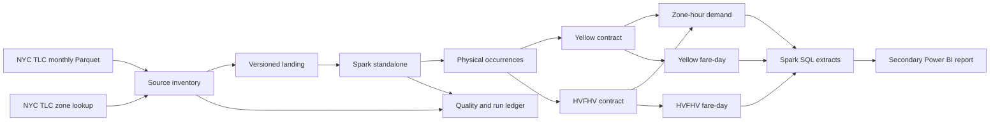

# Architecture

## System boundary

Fareline turns versioned monthly Parquet files into auditable analytical
products. It does not own the source, assign business identity to a trip, or
provide a real-time service.

## Technical identity

The idempotent unit is a source-file version identified by logical URL and
content hash. Each raw row is an occurrence identified by that file version and
its physical ordinal. Equal field values do not imply equal trips, so Fareline
preserves multiplicity and never deduplicates by a heuristic content hash.

M1 derives the ordinal from `_metadata.row_index`, the Parquet reader's physical
row position inside the file. It is produced by the scan before any shuffle, so
it does not depend on how Spark orders or packs file splits, and a landed
version is exactly one file so the in-file index is the version's ordinal.
Ingestion fails unless those ordinals form a dense `0..n-1` sequence.

## Execution modes

- Unit tests run on plain Python and DuckDB, with no Spark dependency.
- The Delta integration smoke runs inside the container on fixtures it generates
  itself, so CI exercises the standalone cluster without touching the source.
- M0 establishes a Docker Compose Spark standalone master and worker baseline;
  M0.1 proves that it can write and read shared output before M1 uses it.
- M3 compares DuckDB, one Spark worker, and multiple Spark workers on the same
  physical host. It records shuffle, spill, skew, memory, time, and file layout.
- Worker-loss testing is valid only against standalone executor processes, not
  `local[*]`.

The container baseline uses Apache Spark 4.1.0, Scala 2.13, Python 3, and Java
17. Delta Lake 4.2.0 is compatible with Spark 4.1.x according to the upstream
[compatibility matrix](https://docs.delta.io/releases/). Delta dependencies and
write semantics enter at M1.

## Shared-storage boundary

The master/driver and every worker mount the same Docker named volumes at
`/opt/fareline/data`, `/opt/fareline/output`, `/opt/fareline/warehouse`, and
`/opt/fareline/spark-events`. A container-local `file://` path is safe only when
it resolves inside one of those shared mounts. `_SUCCESS` alone is never evidence
of publication: the cluster smoke requires visible data files and an exact
write/read count from two executor hosts.

Named volumes make the local filesystem topology explicit and reproducible in
CI. They are not evidence for object-store semantics. M1 records the volume and
path used by each run; M4 must revalidate publication behavior on any selected
cloud storage implementation.

## Delta boundary

M1 publishes one minimal Delta source-occurrence table per service on the bounded vertical
slice. Delta artifacts are supplied as user jars through a coordinate pinned in
the image rather than copied into `/opt/spark/jars`, because their transitive
closure contains older Jackson and Parquet builds that must not take precedence
over the ones Spark ships.

Idempotency is a published-version check followed by an append, which is safe
for the single writer M1 declares and is not safe for two concurrent drivers.
The table also rejects a version whose artifact completeness differs from the
scope already present, preventing sample or fixture rows from contaminating a
future complete-object table.
M2 will validate replacement, atomic publication, schema enforcement and
evolution, and incremental-versus-rebuild equivalence. Fareline will not
generalize a local-filesystem result to multi-process writers or object storage;
stronger claims require M4 on the chosen storage implementation.

Verification never trusts the transaction log alone. After a write the job
re-reads the table and requires a Delta log, data files that exist on the shared
volume, the expected row count and one technical key per row.

## Cloud gate

M0–M3 contain no cloud provider. M4 first compares current role demand,
compatibility, regional availability, identity/IAM, IaC, and estimated cost.
Only an explicitly approved design may be applied. If M4 is skipped, Fareline
remains a local distributed lakehouse and makes no operational cloud claim.
